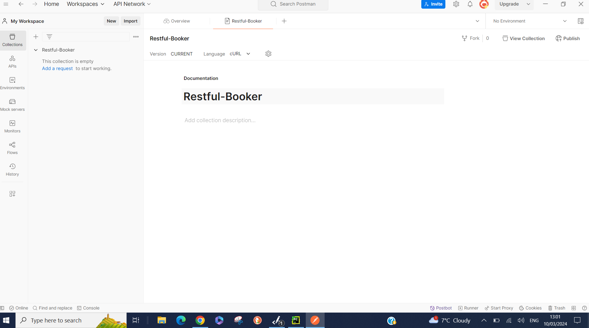
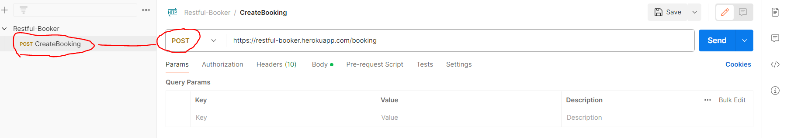
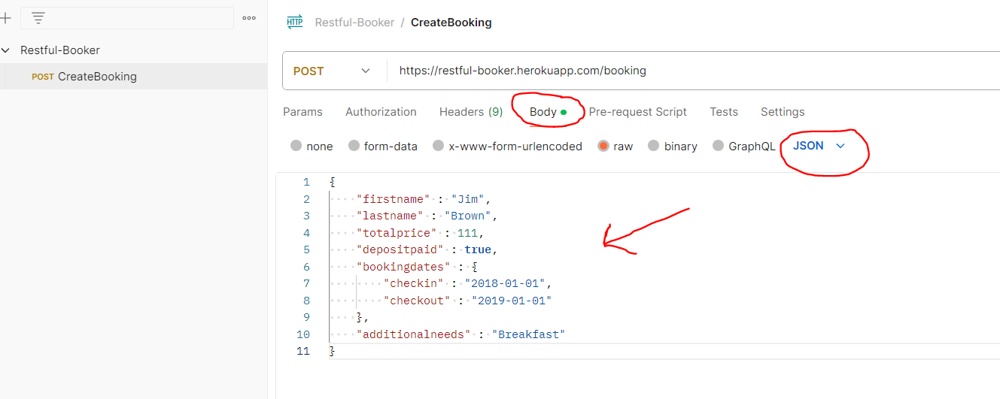
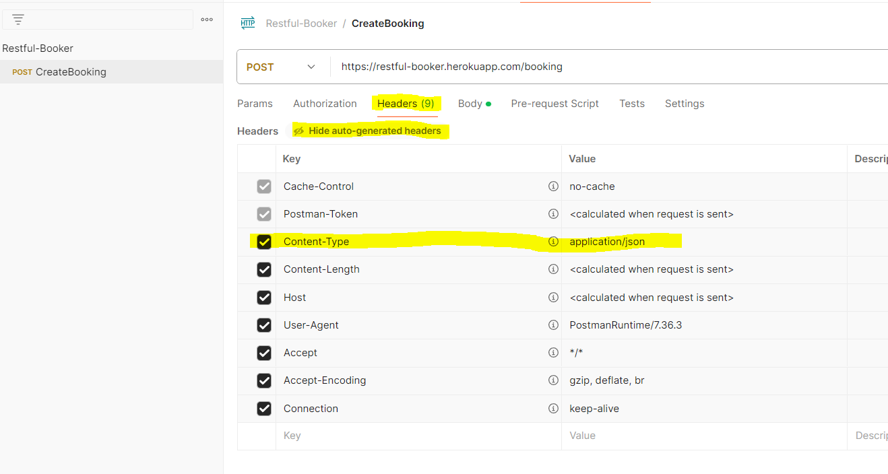
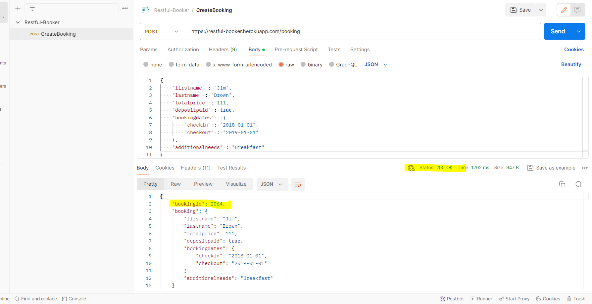

# API Testing - Comparing Postman and Robot Framework with RequestsLibrary 

#### Table of Contents

- [Introduction](#Introduction)
- [API Testing vs UI Testing](#API-Testing-vs-UI-Testing)
- [Acknowledgements](#Acknowledgements)

### Introduction

This repository has been created to explain, in simple terms, how to use Postman to send API requests and how to use Robot Framework with RequestsLibray to carry out the same operations.

#### What is an API?  
_Application Programming Interface_

#### What do they do?  
_APIs allow systems to communicate with each other. Internally, with the systsem's own modules and Externally, with other systems._

#### How do they do it?  
_Every API has rules to what information is required, if the information is valid then the system sending the request will get a successful response. If there's something wrong it will get an unsuccessful response_

##### API Methods
_APIs have several methods used to Create, read, update and delete._  
_They are:_
* POST
* GET
* PUT 
* PATCH
* DELETE

_The general rule of thumb is POST is used to create, GET is used to read, PUT and PATCH are used to update and DELETE to delete._ 
_A request uses one of the methods (POST, GET, PUT, PATCH or DELETE) and when executed sends a response. We are usually looking for the response to be '200' which means its OK._ 
_Depending on the API, and how it was developed, it may or may not be programmed to send additional information. We can verify our tests by capturing these responses and asserting we are getting the correct response when we carry out a request._

_Our Test_ 
_Request-->Do Something with an API Method --> Actual response --> Compare Actual response vs Expected response --> Pass or Fail_

### API Testing Vs UI Testing
_When testing the UI, in theory we just need the url of the website, and we can start testing but with APIs there is no UI involved. We need to be given the documentation for each API we are testing._

#### API Documentation
_There is an excellent website, [Restful Booker](https://restful-booker.herokuapp.com/), created by [Mark Winterington](http://mwtestconsultancy.co.uk/), for practicing API testing. I will be using this website and its content to help explain using Postman and Robot Framework to test its APIs. This is a great resource for learning and has links to more resources for those who want to expand their knowledge. I would definetly recommend you check those out._

##### Using Postman
_If you've never tested API's before then its best to start manually rather than jumping straight into automation._

* Lets start by creating a booking. Go over to the [Create a booking documentation](https://restful-booker.herokuapp.com/apidoc/index.html#api-Booking-CreateBooking) on the Restful Booker website

    * We must use a POST request with a header, a url and a body.
	
* On postman I've created a collection, and will select "Add a request" to create a POST request and fill in the required information. I'm going to copy everything exactly as it is on the website, so that its easier to follow what is happening.

* Change the method to POST in the dropdown and copy in the URL
	

* Go to the Body Tab, select Raw and change the dropdown to JSON and paste in the Body

 

* As we've selected JSON that should now be included in the Headers. To check go to the Headers Tab and unhide the headers. We can see that the required header "Content-Type: application/json" is included. Don't worry about the other headers, they are generated by Postman.

 

* We are now ready to send our request, so from the body tab (so we can compare) click send and see the response underneath.

 

Hopefully you now see the status 200 OK, there is a BookingID and the request Body matches the Booking body. We've just verified that sending a request with a valid body, the correct url and the correct header gives us a valid response.

### Acknowledgements

