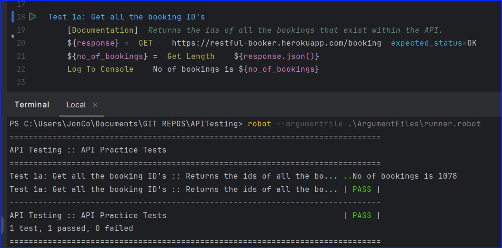
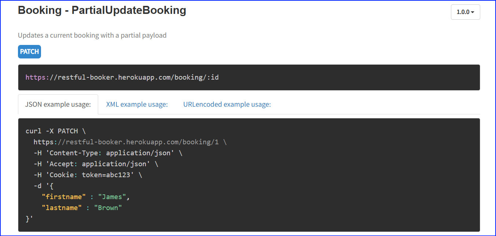

# API Testing - Comparing Postman and Robot Framework with RequestsLibrary 

## Table of Contents

**[Introduction](#Introduction)**

**[API Methods](#API-Methods)**

**[API Testing vs UI Testing](#API-Testing-vs-UI-Testing)**

**[API Documentation](#api-documentation)**

**[Robot Framework testing using RequestsLibrary](#Robot-Framework-testing-using-RequestsLibrary)**

  * [GetBookingIds](#GetBookingIds)

    * [All ID's](#All-IDs)
    * [By a single filter](#By-a-single-filter)
    * [By multiple filters](#By-multiple-filters)
  
  * [GetBooking](#GetBooking)
  * [UpdateBooking](#UpdateBooking)
  * [PartialUpdate](#PartialUpdate)
  * [DeleteBooking](#DeleteBooking)


### Introduction

This repository has been created to explain, how to use Robot Framework with RequestsLibray to automate tests that you might carry out using postman.

### API Methods
APIs have several methods used to create, read, update and delete.<br> 
They are:
* POST
* GET
* PUT 
* PATCH
* DELETE

The general rule of thumb is POST is used to create, GET is used to read, PUT and PATCH are used to update and DELETE to delete.<br>
A request uses one of the methods (POST, GET, PUT, PATCH or DELETE) and when executed sends a response. We are usually looking for the response to be '200' which means its OK._<br>
Depending on the API, and how it was developed, it may or may not be programmed to send additional information. We can verify our tests by capturing these responses and asserting we are getting the correct response when we carry out a request.

_Our Test_<br>
_Request-->Do Something with an API Method --> Actual response --> Compare Actual response vs Expected response --> Pass or Fail_


### API Testing Vs UI Testing
When testing the UI, in theory we just need the url of the website, and we can start testing but with APIs there is no UI involved. We need to be given the documentation for each API we are testing._

### API Documentation
There is an excellent website, [Restful Booker](https://restful-booker.herokuapp.com/), created by [Mark Winterington](http://mwtestconsultancy.co.uk/), for practicing API testing. I will be using this website and its content to help explain using  Robot Framework to test its APIs. This is a great resource for learning and has links to more learning sources for those who want to expand their knowledge. I would definitely recommend you check those out.<br><br>
I will be referring to this page, from the Restful Booker site, throughout, to show how to create the code so that Robot Framework can carry out the requests, [API Docs](https://restful-booker.herokuapp.com/apidoc/index.html). 

### Robot Framework testing using RequestsLibrary

We need to import the requests library. Here is the documentation, [Requests Library](https://marketsquare.github.io/robotframework-requests/doc/RequestsLibrary.html), which contains all the information you might need as well as explanations and notes on all the keywords.

The Restfull booker sites lists the API's in the following order:

* GetBookingIds
  * All IDs
  * By a single filter
  * By multiple filters
* GetBooking
* CreateBooking
* UpdateBooking
* PartialUpdateBooking
* DeleteBooking

We will go through each one and create a Robot Framework test to validate the API.

### GetBookingIds

#### All IDs

Let's have a look at the Documentation provided for this API

<br>1, is a general description of the API. Note it will return something.
<br>2, is the request type in this case "GET".
<br>3, is the url we use to send to the API.<br>
The documentation also states what it will return. A status code of "OK" if it is successful and an object with a list of booking ID's.<br>


We'll start writing the first test to get all the booking ID's<br>
<br>
We need to create a variable to store what's going to be returned, as we might want to use that information to test something else. The ```GET``` keyword in the library can accept an argument to check the expected status, it's set by default to expect OK. Robot Framework lets us pass default arguments to keywords.<br><br>

So let's refactor this test, to include a step to count the number of bookings and check the expected status of the request.<br>
<br>
The status from the API request is OK otherwise the first step would have failed. We are saving the results of our request in a variable. We can count the number of ID's returned by getting the length of the variable, ```${response}```. We specify to the ```Get Length``` keyword that the variable is a json file ```${response.json()}```.<br><br>
_Don't worry if you don't get exactly the same result. The site is open for anybody to change and interact with the data, it resets itself every 15 minutes, so you will most likely get different results._
<br>
#### By a single filter
Going back to the Documentation got "GetBookingIds" and selecting the next tab Example 2.<br>
<br><br>
This example searches for first name and last name. We are going to search just using the first name. Using the url from the previous request we need to add ```?``` and the parameter we'll be searching on. The parameters or filters we are using are specified in the documentation:
<br><br>
So to use a first name of John, we construct the url using the initial construct as in Test 1 ```https://restful-booker.herokuapp.com/booking``` and add ```?firstname=John``` to give ```https://restful-booker.herokuapp.com/booking?firstname=John``` like this:<br><br>
<br><br>
#### By multiple filters
Going back to the Documentation got "GetBookingIds" and selecting the next tab Example 3.<br>
<br><br>
Its very similiar to searching with one parameter. The example shown uses checkin and checkout. So just like constructing the url for one parameter, checkin, ```https://restful-booker.herokuapp.com/booking?checkin=<YYYY-MM-DD>``` then add ```&``` along with the next parameter so its the same as the example in the documentation, ```https://restful-booker.herokuapp.com/booking?checkin=<YYYY-MM-DD>&checkout=<YYYY-MM-DD>```<br><br>
We can use two or all the optional parameters to construct our request just add ```&``` between each ```parameter=value``` pair.<br><br>
We will use the firstname and lastname parameters, to give ```https://restful-booker.herokuapp.com/booking?firstname=Sally&lastname=Brown``` like this:<br><br>
<br><br>

### GetBooking
Lets have a look at the Documentation provided for this API
<br><br>
So this is telling us that we need to construct a request that contains the unique 'id' of the booking. Its also letting us know that by default a successful request will be return a response in json format.<br><br>
Lets look further at the format and information in the response<br><br>
<br><br>
We'll go ahead and get the booking information for the booking with id=1 and we'll use the response to print out all the fields into the console when we run our test.

Here's the Robot Test Case


And here is the output in the report


### Create Booking
We'll start by looking at the documentation for this API


So we need to use a POST request and specify in the header what format we will pass in the booking information, in our case the json format.

We can see the requirements of each field to complete a request and what it's data type is.


First of all lets put the information into a format that we can send in the json format. The python dictionary type can easily be transformed into JSON.

We'll set the ```firstname```, ```lastname```, ```totalprice```, ```depositpaid``` as a dictionary, we'll call ```&{body}``` and create another dictionary called ```&{booking_dates}``` and add this to the ```&{body}``` dictionary.

Also as in all our other tests we'll store the response in variable and ensure all the information we sent is included in the booking response. So our test will look like this:


As you can see it's a bit repetitive and long-winded. Lets try and simplify it.

We get a booking ID when we create the booking in the response. So we could use this ID to get the booking body and compare it with the body we sent.


Here's the report after running the refactored test.


To summarise what we did:
* Created a payload/body for our Post request
* Did a Post request to create a booking
* Got the ID from the booking
* Carried out a Get request on the booking ID
* Verified the original payload we created matches the Get payload

### UpdateBooking

To update a booking using the ```PUT``` request, we need to send authentication along with the payload. Authentication in simple terms means we log into the API and receive a token. Presenting that token to the API means you have permission to change or update things.

Lets have a look at the Documentation for a ```PUT``` request.


So we need a URL with the booking ID, a content-type (payload) in JSON format, Accept means the response will be in JSON format, and we need to provide it with a cookie so the API can check if we are allowed to change things.

Here's some further documentation on what we need to provide for the request and what a successful request will return


So lets handle [getting the token](https://restful-booker.herokuapp.com/apidoc/index.html#api-Auth-CreateToken) for the API first. We can see from the documentation that it consists of a ```POST``` request which we have done before.


We need to save the response payload which is the token we need to use in the ```PUT``` request. Let's get that ready in Robot Framework.


Then we need to create a new booking, get the new booking ID, update the booking, using a PUT request and then ensure the updated booking contains the new information.


Now there's a lot going on and it may look confusing, but if we consider each line of the code it feeds into the next line. We can definitely refactor this and simplify it, by moving steps into their own methods/keywords which we can reuse again. For now, we will keep as is, and later I will share how I've refactored the tests to make them simpler and easier to maintain. Sometimes it's easier to follow the long-winded method while we understand what is happening and then get more abstract as our expertise increases.

### PartialUpdate

To partially update a booking we use the ```PATCH``` request.

The booking ID is sent in the url to partially update a booking. We only need to change a minimum of 1 parameter or in other words, send a partial payload. 


Similar to the ```PUT``` request, the ```PATCH``` request also requires authorization. The other details needed in the header are shown below.


The body or payload we send can include one or more of the parameters below.


The response includes the details below.


Now we know what we need lets change the "additional needs" of the booking with id=2 in Robot Framework.


Here are the Results in the report


### DeleteBooking
To Delete a booking we use ```DELETE``` request.

From the documentation below you can see we need, the url that contains the booking ID we want to delete and Authorisation. The API returns a success code when the operation has been completed.


Let's have a look how we can do that in Robot Framework.


We got the authorisation token, put it in a header then passed this along with the url plus the ID, which we are using, added to the end ```../101``` On executing the  ```DELETE``` keyword we are checking that the ```expected_status=201```

This means the deletion was successfully carried out. So if we try to look up the booking with ```ID=101``` then after being deleted it should no longer be in the database. So running the ```GET``` keyword should not find any record, so we are checking that the ```expected_status=404``` which means it's "Not Found"


