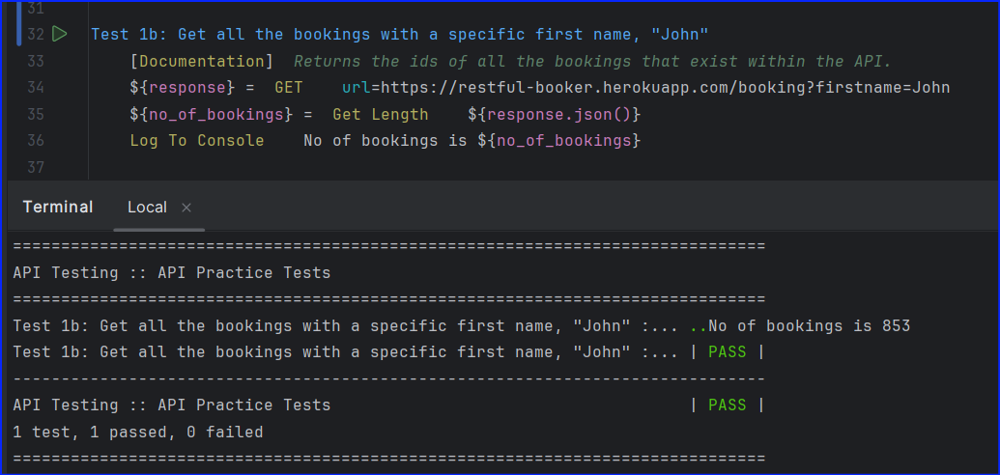
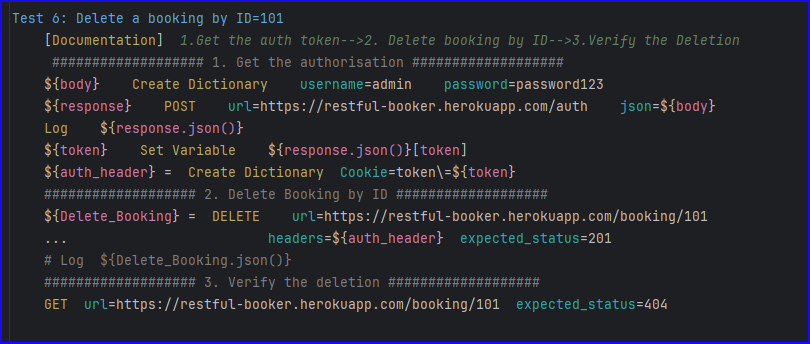

# <a href="https://github.com/JonConnorATI/APITesting" target="_blank">API Testing</a> - Robot Framework with RequestsLibrary 

## Table of Contents

**[Introduction](#Introduction)**

**[API Methods](#API-Methods)**

**[API Testing vs UI Testing](#API-Testing-vs-UI-Testing)**

**[API Documentation](#api-documentation)**

**[Robot Framework testing using RequestsLibrary](#Robot-Framework-testing-using-RequestsLibrary)**

  * [GetBookingIds](#GetBookingIds)

    * [All IDs](#All-IDs)
    * [By a single filter](#By-a-single-filter)
    * [By multiple filters](#By-multiple-filters)
  
  * [GetBooking](#GetBooking)
  * [CreateBooking](#CreateBooking)
  * [UpdateBooking](#UpdateBooking)
  * [PartialUpdate](#PartialUpdate)
  * [DeleteBooking](#DeleteBooking)

**[Discussion](#Discussion)**


### Introduction

This <a href="https://github.com/JonConnorATI/APITesting" target="_blank">repository</a> has been created to explain, how to use Robot Framework with RequestsLibrary to automate tests that you might carry out using `Postman.`

### API Methods
APIs have several methods used to create, read, update and delete.<br> 
They are:
* POST
* GET
* PUT 
* PATCH
* DELETE

The general rule of thumb is POST is used to create, GET is used to read, PUT and PATCH are used to update and DELETE to delete.<br>
A request uses one of the methods (POST, GET, PUT, PATCH or DELETE) and when executed sends a response. We are usually looking for the response to be '200' which means it's OK.<br>
Depending on the API, and how it was developed, it may or may not be programmed to send additional information. We can verify our tests by capturing these responses and asserting we are getting the correct response when we carry out a request.

Our Test 
`Request-->Actual response --> Compare with Expected response --> Pass or Fail`


### API Testing Vs UI Testing
When testing the UI, in theory, we just need the URL of the website, and we can start testing. However, with APIs, there is no UI involved. Instead, we need to be given the documentation for each API we are testing.

### API Documentation
There is an excellent website, <a href="https://restful-booker.herokuapp.com/" target="_blank">Restful Booker</a>, created by <a href="http://mwtestconsultancy.co.uk/" target="_blank">Mark Winterington</a>, for practicing API testing. I will be using this website and its content to help explain using  Robot Framework to test its APIs. This is a great resource for learning and has links to more learning sources for those who want to expand their knowledge. I would definitely recommend you check those out.

The Restfull booker sites lists the APIs in the following order:

* GetBookingIds
  * All IDs
  * By a single filter
  * By multiple filters
* GetBooking
* CreateBooking
* UpdateBooking
* PartialUpdateBooking
* DeleteBooking

I will be referring to this page, from the Restful Booker site, throughout, to show how to create the code so that Robot Framework can carry out the requests. You can find the API documentation <a href="https://restful-booker.herokuapp.com/apidoc/index.html" target="_blank"> here</a>.

### Robot Framework testing using RequestsLibrary

We need to import the requests library. Here is the documentation, <a href="https://marketsquare.github.io/robotframework-requests/doc/RequestsLibrary.html" target="_blank">Requests Library</a>, which contains all the information you might need as well as explanations and notes on all the keywords.

### GetBookingIds

#### All IDs

Let's have a look at the Documentation provided for this API

1. is a general description of the API. Note it will return something.
2. is the request type in this case "GET".
3. is the URL we use to send to the API.

The documentation also states what it will return. A status code of "OK" if it is successful and an object with a list of booking IDs.


We'll start writing the first test to get all the booking IDs<br>

Create a variable to store the returned data for further testing. The `GET` keyword can check the expected status, defaulting to OK. Robot Framework allows passing default arguments to keywords.


So let's refactor this test, to include a step to count the number of bookings and check the expected status of the request.<br>
<br>
The status from the API request is OK otherwise the first step would have failed. We are saving the results of our request in a variable. We can count the number of IDs returned by getting the length of the variable, ```${response}```. We specify to the ```Get Length``` keyword that the variable is a JSON file ```${response.json()}```.<br><br>
_Don't worry if you don't get exactly the same result. The site is open for anybody to change and interact with the data, it resets itself every 15 minutes, so you will most likely get different results._
<br>
#### By a single filter
Going back to the Documentation got "GetBookingIds" and selecting the next tab Example 2.<br>


This example searches for first name and last name. We are going to search just using the first name. Add `?` and the search parameter to the URL from the previous request. The parameters are specified in the documentation. 
<br><br>
So to use a first name of John, we construct the URL using the initial construct as in Test 1 ```https://restful-booker.herokuapp.com/booking``` and add ```?firstname=John``` to give ```https://restful-booker.herokuapp.com/booking?firstname=John``` like this:<br><br>
<br><br>
#### By multiple filters
Going back to the Documentation got "GetBookingIds" and selecting the next tab Example 3.<br>
<br><br>
It's similar to searching with one parameter. For checkin and checkout, construct the URL as `https://restful-booker.herokuapp.com/booking?checkin=<YYYY-MM-DD>&checkout=<YYYY-MM-DD>` then add `&` along with the next parameter so its the same as the example in the documentation, `https://restful-booker.herokuapp.com/booking?checkin=<YYYY-MM-DD>&checkout=<YYYY-MM-DD>`

We can use two or all the optional parameters to construct our request just add `&` between each `parameter=value` pair.

We will use the firstname and lastname parameters, to give `https://restful-booker.herokuapp.com/booking?firstname=Sally&lastname=Brown` like this:


### GetBooking
Lets have a look at the Documentation provided for this API
<br><br>
Construct a request with the unique booking ID. A successful request returns a response in JSON format.

Lets look further at the format and information in the response<br><br>


We'll go ahead and get the booking information for the booking with id=1 and we'll use the response to print out all the fields into the console when we run our test.

Here's the Robot Test Case


And here is the output in the report


### CreateBooking
We'll start by looking at the documentation for this API


So we need to use a POST request and specify in the header what format we will pass in the booking information, in our case the JSON format.

We can see the requirements of each field to complete a request and what it's data type is.


Format the information to send in JSON. Transform the Python dictionary type into JSON. Set `firstname`, `lastname`, `totalprice`, `depositpaid` in a dictionary called `&{body}` and add another dictionary `&{booking_dates}` to `&{body}`.

Also as in all our other tests we'll store the response in variable and ensure all the information we sent is included in the booking response. So our test will look like this:


As you can see it's a bit repetitive and long-winded. Lets try and simplify it.

We get a booking ID when we create the booking in the response. So we could use this ID to get the booking body and compare it with the body we sent.


Here's the report after running the refactored test.


To summarise what we did:
* Created a payload/body for our Post request
* Did a Post request to create a booking
* Got the ID from the booking
* Carried out a Get request on the booking ID
* Verified the original payload we created matches the Get payload

### UpdateBooking

To update a booking with a `PUT` request, send authentication with the payload. Authentication involves logging into the API and receiving a token, which grants permission to make changes

Lets have a look at the Documentation for a `PUT` request.


So we need a URL with the booking ID, a content-type (payload) in JSON format, Accept means the response will be in JSON format, and we need to provide it with a cookie so the API can check if we are allowed to change things.

Here's some further documentation on what we need to provide for the request and what a successful request will return


So lets handle [getting the token](https://restful-booker.herokuapp.com/apidoc/index.html#api-Auth-CreateToken) for the API first. We can see from the documentation that it consists of a `POST` request which we have done before.


We need to save the response payload which is the token we need to use in the `PUT` request. Let's get that ready in Robot Framework.


Then we need to create a new booking, get the new booking ID, update the booking, using a PUT request and then ensure the updated booking contains the new information.


Now there's a lot going on and it may look confusing, but if we consider each line of the code it feeds into the next line. We can definitely refactor this and simplify it, by moving steps into their own methods/keywords which we can reuse again. For now, we will keep as is, and later I will share how I've refactored the tests to make them simpler and easier to maintain. Sometimes it's easier to follow the long-winded method while we understand what is happening and then get more abstract as our expertise increases.

### PartialUpdate

Use a `PATCH` request to partially update a booking. Send the booking ID in the URL and change at least one parameter, sending a partial payload.


Similar to the `PUT` request, the `PATCH` request also requires authorization. The other details needed in the header are shown below.


The body or payload we send can include one or more of the parameters below.


The response includes the details below.


Now we know what we need lets change the "additional needs" of the booking with id=2 in Robot Framework.


Here are the Results in the report


### DeleteBooking
"Use a `DELETE` request to delete a booking. Send the URL containing the booking ID and authorization. The API returns a success code upon completion.


Let's have a look how we can do that in Robot Framework.


We got the authorization token, put it in a header then passed this along with the URL plus the ID, which we are using, added to the end `../101` On executing the  `DELETE` keyword we are checking that the `expected_status=201`

This means the deletion was successfully carried out. So if we try to look up the booking with `ID=101` then after being deleted it should no longer be in the database. So running the `GET` keyword should not find any record, so we are checking that the `expected_status=404` which means it's "Not Found"

Here's the report for this Test Case


### Discussion

This section covers how to use the Requests Library with Robot Framework to perform the following API methods:: 
* POST
* GET
* PUT 
* PATCH
* DELETE

We now understand how to construct the URL for each method, pass authorization and required data using the body and Headers parameters, and utilize the response to verify the information returned from the API.

#### Testing

This repository aims to help you construct test steps and use the correct syntax to create Test Cases. We are using the Restful Booker API documentation for demonstration purposes, not for actual testing.

As mentioned throughout this document the methods can sometimes be lengthy and appear complex. Here is a link to all the tests we created <a href="https://github.com/JonConnorATI/APITesting/blob/main/Robot_Tests/API_methods.robot" target="_blank">API Methods</a>. 

I refactored each method by moving keywords into a resource file for reusability. Additionally, I implemented a function to generate random data, eliminating the need to manually input data repeatedly. The refactored tests can be found here <a href="https://github.com/JonConnorATI/APITesting/blob/main/Robot_Tests/API_methods_Refactored.robot" target="_blank">API_Methods_Refactored</a>.

Hopefully, this makes it easier for you to run API tests in Robot Framework—whether as an alternative to or alongside Postman.

Please note that the Restful Booker API and website are free to use. However, there are some inconsistencies, such as:

* When creating a record, should the response code be 201 (Created) instead of 200 (OK)?
* When deleting a record, should the response code be 200 (OK) instead of 201 (Created)?
* Additionally, I observed an issue where creating a booking with deposit paid set to False results in the booking showing deposit paid as True upon retrieval. This could pose significant problems for data integrity and business logic.

Can you identify any other issues? If you create your own tests and verify whether the actual responses match the expected ones, you're likely to uncover further discrepancies.

I hope this overview has been helpful.

## Happy Testing!!


